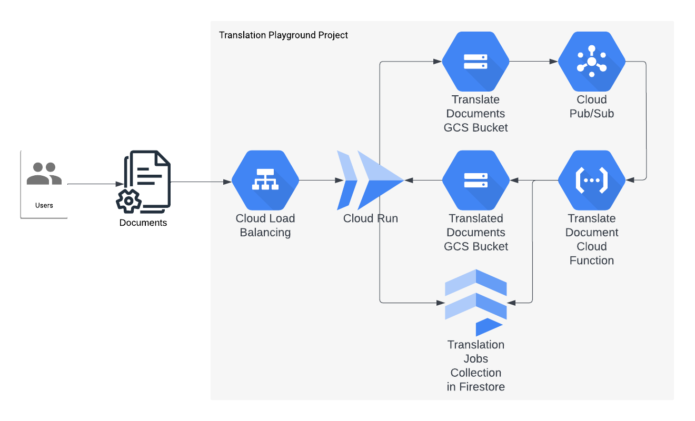

# Google Cloud Translation Playground

A copy of [Google Translate](https://translate.google.ca/?sl=auto&tl=en&op=docs)'s page for translating documents, with the addition that plain text files can also be translated.

## System Overview

## Architecture Diagram

## Components

### [Server](./server)

A [Node.js](https://nodejs.org) server written using [Express](https://expressjs.com/) and [socket.io](https://socket.io/), running on [Cloud Run](https://cloud.google.com/run/docs/overview/what-is-cloud-run). It:

1. Receives the translation request, creates a "translation job" record in [Firestore](https://firebase.google.com/docs/firestore).
1. Uploads the file to the [Cloud Storage bucket](https://cloud.google.com/storage/docs/buckets) to trigger a translation.
1. After the "translation job" has started, it connects to clients via [socket.io](https://socket.io/docs/v4/) to keep them updated about the "translation job's" status. To figure out that status, it gets [realtime updates](https://firebase.google.com/docs/firestore/query-data/listen) about the corresponding document.
1. It provides a route for the user to downlod the translated document when the job is done.

### [Translate Document Cloud Function](./cloud-functions/translate-document)

A [Cloud Function](https://cloud.google.com/functions/docs/concepts/overview) triggered by [files being created in a GCS bucket](https://cloud.google.com/functions/docs/calling/storage). It:

1. Uses the [Cloud Translation API](https://cloud.google.com/translate/docs/reference/rest) to translate the document.
1. Uploads the translated file to another GCS bucket.
1. Updates the "translation job's" status.

### [UI](./server/ui)

An user interface written using [React](https://reactjs.org/), bootstrapped with [create-react-app](https://create-react-app.dev/). It uses [bulma](https://react-bulma.dev/en) as the main provider of components.

## Deployment

The system is deployed using [`terraform`](https://www.terraform.io/), running in [Cloud Build](https://cloud.google.com/build/docs/overview).

### Pre-requisites

1. Create a Google Cloud  [Organization](https://cloud.google.com/resource-manager/docs/creating-managing-organization).
1. Install [`terraform`](https://developer.hashicorp.com/terraform/downloads).
1. Install the [`gcloud` CLI](https://cloud.google.com/sdk/docs/install).
1. Have a [domain](https://en.wikipedia.org/wiki/Domain_name) and the ability to create [`A Records`](https://support.google.com/a/answer/2576578?hl=en#zippy=%2Cconfigure-a-records-now) to [connect that domain to the Load Balancer](https://cloud.google.com/load-balancing/docs/https/setup-global-ext-https-serverless#update_dns).

### Bootstrap

This is the process that creates the Google Cloud [Project](https://cloud.google.com/resource-manager/docs/creating-managing-projects), [enables the required APIs](https://cloud.google.com/apis/docs/getting-started), and grants the necessary permissions to the [Service Accounts](https://cloud.google.com/iam/docs/service-accounts), including the ones required for the [Cloud Build Service Account](https://cloud.google.com/build/docs/cloud-build-service-account) to deploy the system.

1. Run `gcloud auth login`
1. Run `gcloud auth application-default login`.
1. `cd` into the [deployment/google-cloud/terraform/bootstrap](./deployment/google-cloud/terraform/bootstrap) folder.
1. Comment out the entire contents of the [deployment/google-cloud/terraform/bootstrap/backend.tf](deployment/google-cloud/terraform/bootstrap/backend.tf) file.
1. Create a [`terraform.tfvars`](https://developer.hashicorp.com/terraform/language/values/variables#variable-definitions-tfvars-files) file and add your variables' values. Leave the `sourcerepo_name` empty for now.
1. Run `terraform init`.
1. Run `terraform apply -target=module.project`.
1. Uncomment the [deployment/google-cloud/terraform/bootstrap/backend.tf](deployment/google-cloud/terraform/bootstrap/backend.tf) file's contents and add the value of the `tfstate_bucket` output as the value of the `bucket` attribute.
1. Run `terraform init` and answer `yes`.
1. [Create a Cloud Source Repository](https://cloud.google.com/source-repositories/docs/creating-an-empty-repository#gcloud) in the project your just created. Optionally, [fork this repository](https://docs.github.com/en/get-started/quickstart/fork-a-repo) and create a Cloud Source Repository by [mirroring your forked repo](https://cloud.google.com/source-repositories/docs/mirroring-a-github-repository). Update the `sourcerepo_name` variable with the repository name.
1. Run `terraform apply`.

### Deployment

This is a Cloud Build [build](https://cloud.google.com/build/docs/overview#how_builds_work) that actually deploys the system.

1. The pipeline can be triggered by either:
    * Push a commit to your Cloud Source Repository or to your Github fork.
    * Go to your project's [Cloud Build Dashboard](https://console.cloud.google.com/cloud-build/triggers) and manually run the `push-to-branch-deployment` [trigger](https://cloud.google.com/build/docs/triggers).
1. After the build is successful, [connect your domain to the Load Balancer](https://cloud.google.com/load-balancing/docs/https/setup-global-ext-https-serverless#update_dns).